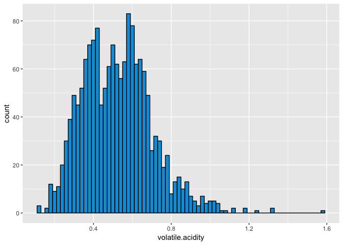

------------------------------------------------------------------------

output: rmarkdown::github\_document

------------------------------------------------------------------------

Red Wine Quality by Patricia Benites
====================================

This report explores a dataset which contains information about red wine quality. It is available for research and the details are described in the paper:

P. Cortez, A. Cerdeira, F. Almeida, T. Matos and J. Reis. Modeling wine preferences by data mining from physicochemical properties.In Decision Support Systems, Elsevier, 47(4):547-553. ISSN: 0167-9236.

Univariate Plots Section
========================

Below are presented all the variables and their types.

    ## 'data.frame':    1599 obs. of  13 variables:
    ##  $ X                   : int  1 2 3 4 5 6 7 8 9 10 ...
    ##  $ fixed.acidity       : num  7.4 7.8 7.8 11.2 7.4 7.4 7.9 7.3 7.8 7.5 ...
    ##  $ volatile.acidity    : num  0.7 0.88 0.76 0.28 0.7 0.66 0.6 0.65 0.58 0.5 ...
    ##  $ citric.acid         : num  0 0 0.04 0.56 0 0 0.06 0 0.02 0.36 ...
    ##  $ residual.sugar      : num  1.9 2.6 2.3 1.9 1.9 1.8 1.6 1.2 2 6.1 ...
    ##  $ chlorides           : num  0.076 0.098 0.092 0.075 0.076 0.075 0.069 0.065 0.073 0.071 ...
    ##  $ free.sulfur.dioxide : num  11 25 15 17 11 13 15 15 9 17 ...
    ##  $ total.sulfur.dioxide: num  34 67 54 60 34 40 59 21 18 102 ...
    ##  $ density             : num  0.998 0.997 0.997 0.998 0.998 ...
    ##  $ pH                  : num  3.51 3.2 3.26 3.16 3.51 3.51 3.3 3.39 3.36 3.35 ...
    ##  $ sulphates           : num  0.56 0.68 0.65 0.58 0.56 0.56 0.46 0.47 0.57 0.8 ...
    ##  $ alcohol             : num  9.4 9.8 9.8 9.8 9.4 9.4 9.4 10 9.5 10.5 ...
    ##  $ quality             : int  5 5 5 6 5 5 5 7 7 5 ...

The data is structured as a dataframe which contains 1,599 instances of red wine and 12 variables. Quality is the output variable and there are 11 input variables. X is the ID of the wines. Considering that the variable X just contains indexes, it will be removed from the dataset.

Below, I start to verify the distribution of the variables visually. I also include the summary of the variables, which contains their min, max, median, and first and third quartiles.


    ##    Min. 1st Qu.  Median    Mean 3rd Qu.    Max. 
    ##    4.60    7.10    7.90    8.32    9.20   15.90

Fixed acidity is the measure of tartaric acid (g)/dm^3. Although its distribution seems like normal, it is right skewed. The majority of wines has fixed acidity less than 9(g)/dm^3.



    ##    Min. 1st Qu.  Median    Mean 3rd Qu.    Max. 
    ##  0.1200  0.3900  0.5200  0.5278  0.6400  1.5800

Volatile acidity is the measure of acetic acid (g)/dm^3. It seems to have a bimodal distribution. The mean and median are very close and they are between the 2 peaks.


    ##    Min. 1st Qu.  Median    Mean 3rd Qu.    Max. 
    ##   0.000   0.090   0.260   0.271   0.420   1.000

Citric acid is the measure of citric acid (g)/dm^3. The variable has its peak at zero, so, there are many wine instances with no levels of citric acid.

Residual sugar is the measure of residual sugar (g)/dm^3. Its distribution is very skewed and we can see that the majority of wines has residual sugar less than 3(g)/dm^3. There are outliers and they can influence its relation with other variables, so, I am going to transform the variable using log base 10. Below there are two summaries: residual sugar and log base 10 of residual sugar.

    ##    Min. 1st Qu.  Median    Mean 3rd Qu.    Max. 
    ##   0.900   1.900   2.200   2.539   2.600  15.500

    ##     Min.  1st Qu.   Median     Mean  3rd Qu.     Max. 
    ## -0.04576  0.27875  0.34242  0.36925  0.41497  1.19033

The new distribution is less skewed than before. We can see that the range was 14.6 and it is now 1.23. However, it still has outliers.


Chlorides are the measure of sodium chloride (g)/dm^3. Its distribution is also very skewed and we can see that the majority of wines has chlorides less than 0.09(g)/dm^3. These outliers can influence its relation with other variables, so, I am going to exclude them.

    ##    Min. 1st Qu.  Median    Mean 3rd Qu.    Max. 
    ## 0.01200 0.07000 0.07900 0.08747 0.09000 0.61100

    ##    Min. 1st Qu.  Median    Mean 3rd Qu.    Max. 
    ## 0.01200 0.06900 0.07800 0.07848 0.08700 0.11900


Excluding outliers of chlorides reduced the range from 0.599 to 0.107 and its distribution is now similar to normal.


    ##    Min. 1st Qu.  Median    Mean 3rd Qu.    Max. 
    ##    1.00    7.00   14.00   15.87   21.00   72.00


    ##    Min. 1st Qu.  Median    Mean 3rd Qu.    Max. 
    ##    6.00   22.00   38.00   46.47   62.00  289.00

Free sulfur dioxide is the measure of free sulfur dioxide(mg)/dm^3. Total sulfur dioxide is the measure of total sulfur dioxide (mg)/dm^3. These two variables have a right skewed distribution, but it does not seem so critical that needs transformation. The range of free sulfur dioxide is smaller than the range of total sulfur dioxide. Also, the majority of wines has free sulfur dioxide less than 21 and total sulfur dioxide less than 62.


    ##    Min. 1st Qu.  Median    Mean 3rd Qu.    Max. 
    ##  0.9901  0.9956  0.9968  0.9967  0.9978  1.0037

Density is the measure of density(g)/cm^3. Its distribution seems like a normal distribution. The majority of wines has the density less than 0.99(g)/cm^3.


    ##    Min. 1st Qu.  Median    Mean 3rd Qu.    Max. 
    ##   2.740   3.210   3.310   3.311   3.400   4.010

PH is the ph of the wine. Its distribution is also normal. Its range goes from 2.74 to 4.01 and most of the wines have pH less than 3.4.


    ##    Min. 1st Qu.  Median    Mean 3rd Qu.    Max. 
    ##  0.3300  0.5500  0.6200  0.6581  0.7300  2.0000

Sulphates is the measure of potassium sulphate (g)/dm^3. Its distribution is right skewed and most of the wines have sulphates less than 0.73(g)/dm^3.


    ##    Min. 1st Qu.  Median    Mean 3rd Qu.    Max. 
    ##    8.40    9.50   10.20   10.42   11.10   14.90

Alcohol is the measure of alcohol(%) by volume. Its distribution is right skewed, but its median and mean are close. Most of the wines have alcohol levels less than 11(%).


    ##    Min. 1st Qu.  Median    Mean 3rd Qu.    Max. 
    ##   3.000   5.000   6.000   5.636   6.000   8.000

Quality is a score which measures the quality of the wine. It can take values from 0 to 10. However, this dataset contains wines with quality that goes from 3 to 8. The majority of wines have quality 5 or 6.

All variables in the dataset are numeric, inputs and output. So, in order to explore other forms of relationship, I am going to create a new variable, quality\_f, which is the variable quality but as a factor, or categorical. This way, I can make boxplots to explore the relationship between two variables in the next section.

``` r
wine$quality_f<- as.factor(wine$quality)
```

    ##   3   4   5   6   7   8 
    ##  10  53 681 638 199  18

Univariate Analysis
===================

### What is the structure of your dataset?

There are 1,599 red wine instances in the dataset and 12 variables: fixed acidity, volatile acidity, citric acid, residual sugar, chlorides, free sulfur dioxide, total sulfur dioxide, density, ph, sulphates, alcohol, and quality. There is also an ID number named X. I created a new variable, quality\_f.

Except for the ID variable and the output variable, quality, all variables are float point numbers. Quality is a score between 0 and 10, 0 means very bad quality and 10 means very excellent quality. The variable has only integer values. Quality\_f is a factor.

Observations:

-   Quality range goes from 3 to 8
-   Most red wine instances has quality 5 or 6
-   The most skewed variables are residual sugar and chlorides
-   There is no missing value

### What is/are the main feature(s) of interest in your dataset?

I would like to investigate which features contribute to predicting the quality of the wine. This first univariate analysis did not reveal much. However, a correlation analysis identified that alcohol and volatile acidity are the most correlated variables to quality. So, these are my starting points.

### What other features in the dataset do you think will help support your investigation into your feature(s) of interest?

Alcohol is correlated to density and volatile acidity is correlated to citric acid. So, I need to explore these relationships in order to see if there are some covered patterns.

### Did you create any new variables from existing variables in the dataset?

Yes, I created quality\_f which is a copy of quality, but as a factor instead of int. Considering that all variables are continuous, it is difficult to make charts other than scatter plots. So, the objective is to make another kind of analysis, like boxplot.

### Of the features you investigated, were there any unusual distributions? Did you perform any operations on the data to tidy, adjust, or change the form of the data? If so, why did you do this?

Yes, the distributions of residual sugar and chlorides are very skewed. So, I transformed residual sugar to log base 10 with the purpose of making the distribution less skewed. In the case of chlorides, I excluded the outliers.

Bivariate Plots Section
=======================

This section investigates the relationship between two variables. In order to get some insights, I am going to begin with the ggcorr function.


Bivariate Analysis
==================

The variables alcohol and volatile acidity are the most correlated with quality. There are also some variables which are highly correlated to each other as citric acid and fixed acidity, density and fixed acidity, pH and fixed acidity, pH and citric acid, and density and alcohol. Below, there are some boxplots of variables which show some relationship with quality.


Alcohol has the biggest correlation with quality, approximately 0.5. This relationship can be seen in this boxplot. However, wines with quality 3, 4 and 5 seem to have similar values of min and median. Categories 6, 7 and 8 show some difference.


Volatile acidity has a high negative correlation with quality, approximately -0.4. This relationship can be seen also in the boxplot. It is clear that when quality goes up, volatile acidity goes down. Except for wines of quality 7 and 8 which have similar values of the median.


Citric acid has a positive correlation with quality, approximately 0.2. In this boxplot, we can see a positive pattern. However, it seems that wines with quality 1 and 2 have similar values for the median, then wines with quality 3 and 4 have higher values of the median and they are also similar. Finally, wines with quality 7 and 8 have higher and similar values of the median.


Density has a negative correlation with quality, approximately -0.2. In this boxplot, the negative relationship is weak. Wines of quality 4, 5 and 6 have similar values of the median, so the pattern is not clear.


Total sulfur dioxide has a negative correlation with quality, approximately -0.2. The first boxplot contains outliers, so, I excluded them in order to have a better chart. It seems that the relationship between total sulfur dioxide and quality is not linear. Wines with quality 5 and 6 have high levels of total sulfur dioxide, but wines with quality 4 and 7 have similar levels of total sulfur dioxide.


Sulphates has a positive correlation with quality, approximately 0.3. The boxplot of the variable showed many outliers which could cover some trend. So, I made new boxplot excluding outliers. Wines with quality 3 and 4 have similar values of the median. However, for wines with quality 5, 6 and 7 it seems that there is a linear relationship.

    ## 
    ##  Pearson's product-moment correlation
    ## 
    ## data:  quality and sulphates
    ## t = 16.815, df = 1538, p-value < 2.2e-16
    ## alternative hypothesis: true correlation is not equal to 0
    ## 95 percent confidence interval:
    ##  0.3510234 0.4354456
    ## sample estimates:
    ##       cor 
    ## 0.3940654

After excluding outliers from sulphates, it was necessary to calculate a new correlation between the variable and quality. We can see that the correlation is higher without outliers.

### Talk about some of the relationships you observed in this part of the investigation. How did the feature(s) of interest vary with other features in the dataset?

I could find three general patterns: volatile acidity, alcohol, and sulphates(after excluding outliers). When quality goes up, volatile acidity goes down. The opposite happens with alcohol and sulphates, that means, when quality goes up, alcohol and sulpahtes also go up.

### Did you observe any interesting relationships between the other features (not the main feature(s) of interest)?

Yes. There are variables correlated to each other as citric acid and fixed acidity, density and fixed acidity, pH and fixed acidity, pH and citric acid, and density and alcohol. An interesting fact is that the exclusion of outliers helped to uncover a relationship between quality and sulphates and the new correlation between sulphates and quality (which it was 0.3) is 0.394

### What was the strongest relationship you found?

Volatile acidity and quality. Although the correlation between quality and alcohol is stronger than the correlation between quality and volatile acidity (0.476 versus -0.391), the boxplots show a more clear pattern between quality and volatile acidity.

Multivariate Plots Section
==========================

From the beggining of the analysis until here, some variables showed a relationship with the quality of the wine as volatile acidity, alcohol and sulphates(without outliers). Below, I am going to create some plots to better investigate the relationships between them.


Based only in the points, it seems that wines with low volatile acidity and high sulphates level have better quality. However, considering the regression lines by category, it seems that given a level of volatile acidity, higher levels of sulphates are related to better quality.


As the previous chart, considering the regression lines by category, it seems that given a level of volatile acidity, higher levels of alcohol are related to better quality. But the relationship is not so accurate, because category five has lower levels of alcohol than category four, for example.


This graph seems to show a clearer relationship than the previous ones. Looking at the regression lines we can see that low values of alcohol are related to wines with quality 3. Then, given a level of alcohol, higher levels of sulphates are related to better quality.

Below, there are two regression models which have the purpose of exploring the relationships found in this section.

    ## 
    ## Call:
    ## lm(formula = quality ~ alcohol + sulphates, data = subset(wine, 
    ##     wine$sulphates < out_s))
    ## 
    ## Residuals:
    ##      Min       1Q   Median       3Q      Max 
    ## -2.91567 -0.35113 -0.06686  0.47518  2.19377 
    ## 
    ## Coefficients:
    ##             Estimate Std. Error t value Pr(>|t|)    
    ## (Intercept)  1.21621    0.17555   6.928 6.26e-12 ***
    ## alcohol      0.30279    0.01648  18.372  < 2e-16 ***
    ## sulphates    1.97887    0.14559  13.592  < 2e-16 ***
    ## ---
    ## Signif. codes:  0 '***' 0.001 '**' 0.01 '*' 0.05 '.' 0.1 ' ' 1
    ## 
    ## Residual standard error: 0.6706 on 1537 degrees of freedom
    ## Multiple R-squared:  0.3074, Adjusted R-squared:  0.3065 
    ## F-statistic: 341.1 on 2 and 1537 DF,  p-value: < 2.2e-16

    ## 
    ## Call:
    ## lm(formula = quality ~ alcohol + sulphates + volatile.acidity, 
    ##     data = subset(wine, wine$sulphates < out_s))
    ## 
    ## Residuals:
    ##      Min       1Q   Median       3Q      Max 
    ## -2.91416 -0.38143 -0.05384  0.47041  2.03825 
    ## 
    ## Coefficients:
    ##                  Estimate Std. Error t value Pr(>|t|)    
    ## (Intercept)       2.30965    0.19876   11.62   <2e-16 ***
    ## alcohol           0.28022    0.01606   17.44   <2e-16 ***
    ## sulphates         1.49907    0.14781   10.14   <2e-16 ***
    ## volatile.acidity -1.04286    0.09889  -10.55   <2e-16 ***
    ## ---
    ## Signif. codes:  0 '***' 0.001 '**' 0.01 '*' 0.05 '.' 0.1 ' ' 1
    ## 
    ## Residual standard error: 0.6477 on 1536 degrees of freedom
    ## Multiple R-squared:  0.3541, Adjusted R-squared:  0.3529 
    ## F-statistic: 280.8 on 3 and 1536 DF,  p-value: < 2.2e-16

    ## 
    ## Calls:
    ## m1: lm(formula = quality ~ alcohol + sulphates, data = subset(wine, 
    ##     wine$sulphates < out_s))
    ## m2: lm(formula = quality ~ alcohol + sulphates + volatile.acidity, 
    ##     data = subset(wine, wine$sulphates < out_s))
    ## 
    ## ================================================
    ##                          m1            m2       
    ## ------------------------------------------------
    ##   (Intercept)           1.216***      2.310***  
    ##                        (0.176)       (0.199)    
    ##   alcohol               0.303***      0.280***  
    ##                        (0.016)       (0.016)    
    ##   sulphates             1.979***      1.499***  
    ##                        (0.146)       (0.148)    
    ##   volatile.acidity                   -1.043***  
    ##                                      (0.099)    
    ## ------------------------------------------------
    ##   R-squared             0.307         0.354     
    ##   adj. R-squared        0.306         0.353     
    ##   sigma                 0.671         0.648     
    ##   F                   341.062       280.752     
    ##   p                     0.000         0.000     
    ##   Log-likelihood    -1568.203     -1514.376     
    ##   Deviance            691.102       644.440     
    ##   AIC                3144.406      3038.752     
    ##   BIC                3165.764      3065.449     
    ##   N                  1540          1540         
    ## ================================================

Although the model's variables were chosen based on the previous analysis and their coefficients are all significant at a level smaller than 0.001 (\*\*\*), the models do not have a good predictive power since their r-squared are 0.4. Below, the plot of the residuals (model 2) shows that they are not around zero, where they should be.


Multivariate Analysis
=====================

### Talk about some of the relationships you observed in this part of the investigation. Were there features that strengthened each other in terms of looking at your feature(s) of interest?

The first two graphs show that in general, good quality wines have low volatile acidity. Also, given a volatile acidity level, higher levels of alcohol or sulphates are related to better quality wines. In all graphs which consider alcohol or sulphates, we can see that higher levels of alcohol or sulphates are related to better quality wines.

### Were there any interesting or surprising interactions between features?

Yes. I believe the clearest pattern is shown in the graph which considers alcohol and sulphates. After excluding the outliers, the variable sulphates showed a clearer positive relationship with quality.

### Did you create any models with your dataset? Discuss the strengths and limitations of your model.

I created two regression models. In the first model, the dependent variable is quality and the explanatory variables are alcohol and sulphates. Then, I added volatile acidity in the second model. Although the variables were chosen as part of a process of investigation, the R-squared was low and the residuals are not around zero, as they should be. So, this is not a good predictive model. Maybe I should not have used linear regression in this dataset. So, in further analysis, I intend to try a classification technique.

------------------------------------------------------------------------

Final Plots and Summary
=======================

### Plot One


### Description One

Quality is the output variable. Quality\_f is the output variable as a factor, so we have categories. There are 6 categories and the majority of the wines are classified as quality 5 or 6.

### Plot Two


### Description Two

These three variables have the clearest relationship with the quality of the wine. Volatile acidity has a negative relationship with quality and a correlation of -0.4. Alcohol and sulphates have a positive relationship with quality and a correlation of 0.5 and 0.3 respectively.

### Plot Three


### Description Three

Plot three shows that wines with quality 3 (lowest quality) are concentrated in the low left corner, so, they have low levels of alcohol and sulphates. For the other categories, looking at the regression lines we can see that given a level of alcohol, higher levels of sulphates are related to better quality.

------------------------------------------------------------------------

Reflection
==========

The Red Wine Quality dataset contains information of 1,599 instances. All the variables in the original dataset are numeric. I started by looking at the summary of the variables and their distribution. Two variables had very skewed distribution.

In the bivariate analysis, I started looking at the correlations between variables. Volatile acidity, alcohol, and sulphates showed the higher correlation with quality. I also explored other variables with smaller correlation with quality, but the results were not so good. So, I found that three variables could be useful in the linear regression model: alcohol, sulphates and volatile acidity.

The regression model, however, did not show good results and this is the limitation of this report. The model did not show a good explanatory power since its R-squared is 0.4. This way, a future work could apply a classification technique in order to try to get a better result.

In summary, the most meaningful conclusion comes from Plot Three in the Final Plots and Summary section. Wines with quality 3 (lowest quality) are concentrated in the low left corner of the chart, meaning that they have low levels of alcohol and sulphates. For the other categories, looking at the regression lines, given a level of alcohol, higher levels of sulphates are related to better quality.
