# Project 2 - Titanic


Dataset

This project focuses on the analysis of the Titanic dataset - a dataset containing the information about 891 passengers of the Titanic, including the passenger ID, if the passenger survived or not, the passenger class, name, gender, age, number of Siblings/Spouses aboard Titanic, number of Parents/Children aboard Titanic, the ticket number, the passenger fare, the passenger cabin and the port of embarkation.


## Questions

There are a number of questions about this dataset that are  interesting to investigate:

1. How many people did survive?
2. What is the group of survivors composed of? Are there more men or women?
3. In the group of survivors, what is the distribution of age?
4. In that group of survivors, what is the proportion of class?
5. Is there a group (gender, class, age) that is more likely of surviving?
6. What factors or characteristics matter to the probability of surviving?


## Investigation Process

  In order to answer these questions, the dataset was first divided into two groups: passengers who survived and passengers who did not survive. A number of conditional probabilities were then calculated such as the probability of surviving given that a passenger is a man. It was also performed the analysis of the age distribution for passengers that survived versus those who did not survive. Some inicial findings showed that the probability of surviving is very different between men and women which prompted the further subdivision of these groups into male survivors, male non survivors, female survivors and female non survivors .
  
   With these four datasets, it was possible to investigate better the relationship between gender and probability of surviving. A correlation was found between age and the variable survived, which indicates if the person survived or not. Lastly, a logistic regression was performed in order to analyze which variables impact significantly the probability of surviving.
   
   In the data cleaning process, the only problem found was missing values in three variables: Age, Cabin and Embarked. In this project, the variable Age was analyzed, so it was necessary to handle missing values. This way when the variable Age was included in the analysis, the rows with missing values were dropped, but when the variable Age was not in the analysis, the 891 observations were used to perform such analysis. 


## Data Wrangling and Exploration


```python
import numpy as np
import pandas as pd

titanic_dataset = pd.read_csv('titanic-data.csv')
titanic_dataset.head()
```


<div>
<table border="1" class="dataframe">
  <thead>
    <tr style="text-align: right;">
      <th></th>
      <th>PassengerId</th>
      <th>Survived</th>
      <th>Pclass</th>
      <th>Name</th>
      <th>Sex</th>
      <th>Age</th>
      <th>SibSp</th>
      <th>Parch</th>
      <th>Ticket</th>
      <th>Fare</th>
      <th>Cabin</th>
      <th>Embarked</th>
    </tr>
  </thead>
  <tbody>
    <tr>
      <th>0</th>
      <td>1</td>
      <td>0</td>
      <td>3</td>
      <td>Braund, Mr. Owen Harris</td>
      <td>male</td>
      <td>22.0</td>
      <td>1</td>
      <td>0</td>
      <td>A/5 21171</td>
      <td>7.2500</td>
      <td>NaN</td>
      <td>S</td>
    </tr>
    <tr>
      <th>1</th>
      <td>2</td>
      <td>1</td>
      <td>1</td>
      <td>Cumings, Mrs. John Bradley (Florence Briggs Th...</td>
      <td>female</td>
      <td>38.0</td>
      <td>1</td>
      <td>0</td>
      <td>PC 17599</td>
      <td>71.2833</td>
      <td>C85</td>
      <td>C</td>
    </tr>
    <tr>
      <th>2</th>
      <td>3</td>
      <td>1</td>
      <td>3</td>
      <td>Heikkinen, Miss. Laina</td>
      <td>female</td>
      <td>26.0</td>
      <td>0</td>
      <td>0</td>
      <td>STON/O2. 3101282</td>
      <td>7.9250</td>
      <td>NaN</td>
      <td>S</td>
    </tr>
    <tr>
      <th>3</th>
      <td>4</td>
      <td>1</td>
      <td>1</td>
      <td>Futrelle, Mrs. Jacques Heath (Lily May Peel)</td>
      <td>female</td>
      <td>35.0</td>
      <td>1</td>
      <td>0</td>
      <td>113803</td>
      <td>53.1000</td>
      <td>C123</td>
      <td>S</td>
    </tr>
    <tr>
      <th>4</th>
      <td>5</td>
      <td>0</td>
      <td>3</td>
      <td>Allen, Mr. William Henry</td>
      <td>male</td>
      <td>35.0</td>
      <td>0</td>
      <td>0</td>
      <td>373450</td>
      <td>8.0500</td>
      <td>NaN</td>
      <td>S</td>
    </tr>
  </tbody>
</table>
</div>


```python
# Number of passengers in this sample
len(titanic_dataset)
```


    891


```python
# What the type of data of each variable
titanic_dataset.dtypes
```


    PassengerId      int64
    Survived         int64
    Pclass           int64
    Name            object
    Sex             object
    Age            float64
    SibSp            int64
    Parch            int64
    Ticket          object
    Fare           float64
    Cabin           object
    Embarked        object
    dtype: object


```python
# Are there missing values?
titanic_dataset.info()
```

    <class 'pandas.core.frame.DataFrame'>
    RangeIndex: 891 entries, 0 to 890
    Data columns (total 12 columns):
    PassengerId    891 non-null int64
    Survived       891 non-null int64
    Pclass         891 non-null int64
    Name           891 non-null object
    Sex            891 non-null object
    Age            714 non-null float64
    SibSp          891 non-null int64
    Parch          891 non-null int64
    Ticket         891 non-null object
    Fare           891 non-null float64
    Cabin          204 non-null object
    Embarked       889 non-null object
    dtypes: float64(2), int64(5), object(5)
    memory usage: 83.6+ KB
    


```python
# The values in this variable
titanic_dataset['Survived'].value_counts(dropna=False)
```


    0    549
    1    342
    Name: Survived, dtype: int64


```python
titanic_dataset['Pclass'].value_counts(dropna=False)
```


    3    491
    1    216
    2    184
    Name: Pclass, dtype: int64


```python
titanic_dataset['Sex'].value_counts(dropna=False)
```


    male      577
    female    314
    Name: Sex, dtype: int64


```python
# Age is a quantitative variable, so it is interesting to investigate its mean, median, min, max and percentiles
titanic_dataset['Age'].describe()
```


    count    714.000000
    mean      29.699118
    std       14.526497
    min        0.420000
    25%             NaN
    50%             NaN
    75%             NaN
    max       80.000000
    Name: Age, dtype: float64


```python
titanic_dataset['SibSp'].value_counts(dropna=False)
```


    0    608
    1    209
    2     28
    4     18
    3     16
    8      7
    5      5
    Name: SibSp, dtype: int64


```python
titanic_dataset['Parch'].value_counts(dropna=False)
```


    0    678
    1    118
    2     80
    5      5
    3      5
    4      4
    6      1
    Name: Parch, dtype: int64


###### Initial Findings: 
There are 891 passengers; 342 survived and 549 did not survive; 3 classes (1,2,3); 577 males and 314 females; age goes from 0 to 80, but there are only 714 observations; SibSp goes from 0 to 8; Parch goes from 0 to 6.


```python
# Creating a new dataset to explore
titanic_1 = titanic_dataset[['PassengerId', 'Survived', 'Pclass', 'Sex', 'Age', 'SibSp', 'Parch']]
titanic_1.head()
```


<div>
<table border="1" class="dataframe">
  <thead>
    <tr style="text-align: right;">
      <th></th>
      <th>PassengerId</th>
      <th>Survived</th>
      <th>Pclass</th>
      <th>Sex</th>
      <th>Age</th>
      <th>SibSp</th>
      <th>Parch</th>
    </tr>
  </thead>
  <tbody>
    <tr>
      <th>0</th>
      <td>1</td>
      <td>0</td>
      <td>3</td>
      <td>male</td>
      <td>22.0</td>
      <td>1</td>
      <td>0</td>
    </tr>
    <tr>
      <th>1</th>
      <td>2</td>
      <td>1</td>
      <td>1</td>
      <td>female</td>
      <td>38.0</td>
      <td>1</td>
      <td>0</td>
    </tr>
    <tr>
      <th>2</th>
      <td>3</td>
      <td>1</td>
      <td>3</td>
      <td>female</td>
      <td>26.0</td>
      <td>0</td>
      <td>0</td>
    </tr>
    <tr>
      <th>3</th>
      <td>4</td>
      <td>1</td>
      <td>1</td>
      <td>female</td>
      <td>35.0</td>
      <td>1</td>
      <td>0</td>
    </tr>
    <tr>
      <th>4</th>
      <td>5</td>
      <td>0</td>
      <td>3</td>
      <td>male</td>
      <td>35.0</td>
      <td>0</td>
      <td>0</td>
    </tr>
  </tbody>
</table>
</div>


```python
# Creating 2 datasets - survivors and nonsurvivors

titanic_survived = titanic_1[(titanic_1['Survived'] == 1)]

titanic_nsurvived = titanic_1[(titanic_1['Survived'] == 0)]

```


```python
# Number of passengers in each class
print(titanic_survived['Pclass'].value_counts())

print(' ')

print(titanic_nsurvived['Pclass'].value_counts())
```

    1    136
    3    119
    2     87
    Name: Pclass, dtype: int64
     
    3    372
    2     97
    1     80
    Name: Pclass, dtype: int64
    


```python
#Probability of surviving according to class
# Number of passengers who survived in such class (1,2 or 3)/ Total number of passengers in that class (survivors and nonsurvivors)

titanic_1.groupby(['Pclass'])['Survived'].mean()
```


    Pclass
    1    0.629630
    2    0.472826
    3    0.242363
    Name: Survived, dtype: float64


###### Probability of surviving according to class

P(Survive|class1) = 0.6296

P(Survive|class2) = 0.4728

P(Survive|class3) = 0.2424

These conditional probability values show that the class in which the passenger traveled is related to his probability of surviving. Passengers who traveled in first class are more likely of surviving.


```python
import seaborn as sns
import matplotlib.pyplot as plt
%pylab inline

#This graph shows the probability of surviving according to class
# bivariate bar graph
sns.factorplot(x="Pclass", y="Survived", data=titanic_1, kind="bar", ci=None)
plt.xlabel('Passenger Class')
plt.ylabel('Probability of Surviving')
plt.title('Probability of surviving according to passenger class')
```

    Populating the interactive namespace from numpy and matplotlib
    


    <matplotlib.text.Text at 0x13506358>


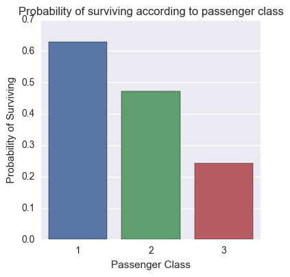


```python
# Number of female and male survivors and nonsurvivors
print (titanic_survived['Sex'].value_counts())
print (' ')
print (titanic_nsurvived['Sex'].value_counts())
```

    female    233
    male      109
    Name: Sex, dtype: int64
     
    male      468
    female     81
    Name: Sex, dtype: int64
    


```python
#Probability of surviving according to gender
# Number of females/males who survived/ Total number of females/males (survivors and nonsurvivors)
titanic_1[titanic_1['Survived'] == 1]['Sex'].value_counts() / (titanic_1[titanic_1['Survived'] == 0]['Sex'].value_counts() + titanic_1[titanic_1['Survived'] == 1]['Sex'].value_counts())
```


    female    0.742038
    male      0.188908
    Name: Sex, dtype: float64


###### Probability of surviving according to gender

P(Survive|Female) = 0.7420

P(Survive|Male) = 0.1889


These conditional probability values show that the gender of the passenger influenced in her probability of surviving. Female passengers are more likely of surviving.


```python
# probability of surviving according to gender
# bivariate bar graph
sns.factorplot(x="Sex", y="Survived", data=titanic_1, kind="bar", ci=None)
plt.xlabel('Passenger Gender')
plt.ylabel('Probability of Surviving')
plt.title('Probability of surviving according to the passenger gender')
```


    <matplotlib.text.Text at 0x13826780>


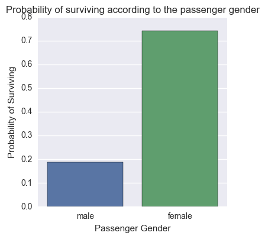


```python
# Creating a Series which contain the age of survivors and dropping missing values
survived_age = titanic_survived['Age'].dropna()
survived_age.head()
```


    1    38.0
    2    26.0
    3    35.0
    8    27.0
    9    14.0
    Name: Age, dtype: float64


```python
plt.hist(survived_age, bins=10)
plt.xlabel('Passenger Age')
plt.ylabel('Frequency')
plt.title('Distribution of age for passengers who survived')
```


    <matplotlib.text.Text at 0x13b5bcc0>


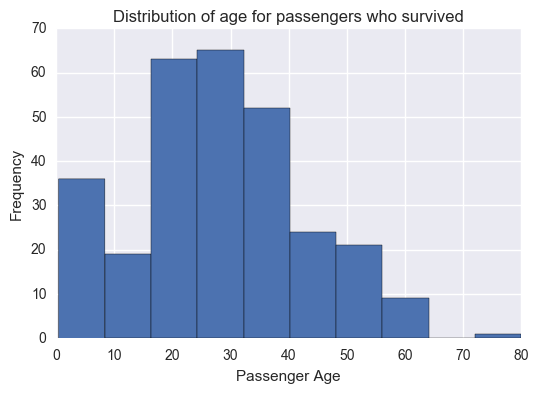


```python
# Creating a Series which contain the age of nonsurvivors and dropping missing values
nsurvived_age = titanic_nsurvived['Age'].dropna()

nsurvived_age.head()
```


    0     22.0
    4     35.0
    6     54.0
    7      2.0
    12    20.0
    Name: Age, dtype: float64


```python
plt.hist(nsurvived_age, bins=10)
plt.xlabel('Passenger Age')
plt.ylabel('Frequency')
plt.title('Distribution of age for passengers who did not survive')
```


    <matplotlib.text.Text at 0x13cd4160>


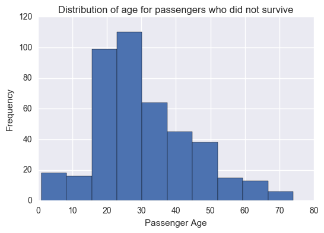


```python
# Descriptive Statistics of the variable Age for survivors and nonsurvivors
print(survived_age.describe())
print(' ')
print(nsurvived_age.describe())
```

    count    290.000000
    mean      28.343690
    std       14.950952
    min        0.420000
    25%       19.000000
    50%       28.000000
    75%       36.000000
    max       80.000000
    Name: Age, dtype: float64
     
    count    424.000000
    mean      30.626179
    std       14.172110
    min        1.000000
    25%       21.000000
    50%       28.000000
    75%       39.000000
    max       74.000000
    Name: Age, dtype: float64
    


```python
# Creating a DataFrame in order to prepare a boxplot
age_df = titanic_1[['Survived', 'Age']].dropna()
age_df.head()
```


<div>
<table border="1" class="dataframe">
  <thead>
    <tr style="text-align: right;">
      <th></th>
      <th>Survived</th>
      <th>Age</th>
    </tr>
  </thead>
  <tbody>
    <tr>
      <th>0</th>
      <td>0</td>
      <td>22.0</td>
    </tr>
    <tr>
      <th>1</th>
      <td>1</td>
      <td>38.0</td>
    </tr>
    <tr>
      <th>2</th>
      <td>1</td>
      <td>26.0</td>
    </tr>
    <tr>
      <th>3</th>
      <td>1</td>
      <td>35.0</td>
    </tr>
    <tr>
      <th>4</th>
      <td>0</td>
      <td>35.0</td>
    </tr>
  </tbody>
</table>
</div>


```python
# Number of observations for the boxplot
len(age_df)
```


    714


```python
# Boxplot of the variable Age (in years) for survivors (1) and nonsurvivors (0)
age_df.boxplot(by = 'Survived')
```


    <matplotlib.axes._subplots.AxesSubplot at 0x13cca128>


###### Age Distribution

The variable Age doesn´t seem much different for the two groups - passengers who survived and passenger who did not survive. 
Their mean  and standard deviation are close, the medians are the same. Besides, their min, max, first percentile and third percentile are close too. 


```python
# Number of siblings/spouse that survivors and nonsurvivors had aboard Titanic
print (titanic_survived['SibSp'].value_counts())
print (' ')
print(titanic_nsurvived['SibSp'].value_counts())
```

    0    210
    1    112
    2     13
    3      4
    4      3
    Name: SibSp, dtype: int64
     
    0    398
    1     97
    4     15
    2     15
    3     12
    8      7
    5      5
    Name: SibSp, dtype: int64
    


```python
# Creating a DataFrame in order to analyze the number of siblings/spouse and the probability of surviving
surv_sib_df = titanic_1[['Survived', 'SibSp']].dropna()

surv_sib_df.head()
```


<div>
<table border="1" class="dataframe">
  <thead>
    <tr style="text-align: right;">
      <th></th>
      <th>Survived</th>
      <th>SibSp</th>
    </tr>
  </thead>
  <tbody>
    <tr>
      <th>0</th>
      <td>0</td>
      <td>1</td>
    </tr>
    <tr>
      <th>1</th>
      <td>1</td>
      <td>1</td>
    </tr>
    <tr>
      <th>2</th>
      <td>1</td>
      <td>0</td>
    </tr>
    <tr>
      <th>3</th>
      <td>1</td>
      <td>1</td>
    </tr>
    <tr>
      <th>4</th>
      <td>0</td>
      <td>0</td>
    </tr>
  </tbody>
</table>
</div>


```python
surv_sib_df['SibSp'].value_counts(sort = True, dropna=False)
```


    0    608
    1    209
    2     28
    4     18
    3     16
    8      7
    5      5
    Name: SibSp, dtype: int64


```python
"""
Probability of surviving according to siblings/spouse aboard Titanic. 0 if the passenger had not siblings or spouse aboard
Titanic, 1 if the passenger had at least one sibling or spouse aboard Titanic. So, if the passenger had more than one 
sibling or spouse, the variable SibSp was recoded to 1.

"""

recode1 = {0: 0, 1: 1, 2: 1, 3: 1, 4: 1, 5: 1, 8: 1}

surv_sib_df['SibSp']= surv_sib_df['SibSp'].map(recode1)

surv_sib_df['SibSp'].value_counts(sort = True, dropna=False)
```


    0    608
    1    283
    Name: SibSp, dtype: int64


```python
# Probability of surviving according to siblings/spouse aboard Titanic
# Number of survivors who have/ do not have siblings/spouse aboard Titanic/ Total number of survivors and nonsurvivors who have/ do not have siblings/spouse aboard Titanic

surv_sib_df[surv_sib_df['Survived'] == 1]['SibSp'].value_counts() / (surv_sib_df[surv_sib_df['Survived'] == 0]['SibSp'].value_counts() + surv_sib_df[surv_sib_df['Survived'] == 1]['SibSp'].value_counts())
```


    0    0.345395
    1    0.466431
    Name: SibSp, dtype: float64


###### Probability of surviving according to Siblings/Spouse aboard Titanic

P(Survive|SibSp-yes) = 0.4664

P(Survive|SibSp-no) = 0.3454

In general, it seems that if the passenger has at least one sibling or spouse aboard Titanic, his probability of surviving is greater than the probability of surviving for passengers who do not have siblings or spouse aboard Titanic. 

Note: 1 means that the passenger has at least one sibling or spouse aboard Titanic; 0 means that the passenger has not a sibling or spouse aboard Titanic.
      


```python
# probability of surviving according to Siblings/Spouse aboard Titanic
# bivariate bar graph
sns.factorplot(x="SibSp", y="Survived", data=surv_sib_df, kind="bar", ci=None)
plt.xlabel('Siblings and Spouse')
plt.ylabel('Probability of Surviving')
plt.title('Probability of surviving according to Siblings/Spouses aboard Titanic ')
```


    <matplotlib.text.Text at 0x14344828>


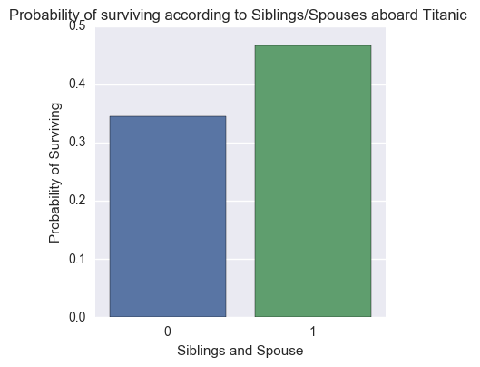


```python
# Number of parents/children that survivors and nonsurvivors had aboard Titanic
print(titanic_survived['Parch'].value_counts())
print (' ')
print(titanic_nsurvived['Parch'].value_counts())
```

    0    233
    1     65
    2     40
    3      3
    5      1
    Name: Parch, dtype: int64
     
    0    445
    1     53
    2     40
    5      4
    4      4
    3      2
    6      1
    Name: Parch, dtype: int64
    


```python
# Creating a DataFrame in order to analyze the number of parents/children and the probability of surviving
surv_parch_df = titanic_1[['Survived', 'Parch']].dropna()

"""
Probability of surviving according to parents/children aboard Titanic. 0 if the passenger had not parents or children aboard
Titanic, 1 if the passenger had at least one parent or child aboard Titanic. So, if the passenger had more than one 
parent or child, the variable Parch was recoded to 1.
"""

recode2 = {0: 0, 1: 1, 2: 1, 3: 1, 4: 1, 5: 1, 6: 1}

surv_parch_df['Parch']= surv_parch_df['Parch'].map(recode2)

surv_parch_df['Parch'].value_counts(sort = True, dropna=False)
```


    0    678
    1    213
    Name: Parch, dtype: int64


```python
# Probability of surviving according to parents/children aboard Titanic
# Number of survivors who have/ do not have parents/children aboard Titanic/ Total number of survivors and nonsurvivors who have/ do not have parents/children aboard Titanic
surv_parch_df[surv_parch_df['Survived'] == 1]['Parch'].value_counts() / (surv_parch_df[surv_parch_df['Survived'] == 0]['Parch'].value_counts() + surv_parch_df[surv_parch_df['Survived'] == 1]['Parch'].value_counts())
```


    0    0.343658
    1    0.511737
    Name: Parch, dtype: float64


###### Probability of Surviving according to Parents/Children aboard Titanic

P(Survive|Parch-yes) = 0.5117

P(Survive|Parch-no) = 0.3437

In general, it seems that if the passenger has at least one parent or child aboard Titanic, his probability of surviving is greater than the probability of surviving for passengers who do not have a parent or child aboard Titanic. 

Note: 1 means that the passenger has at least one parent or child aboard Titanic; 0 means that the passenger has not a parent or child aboard Titanic.


```python
# probability of surviving according to Parents/Children aboard Titanic
# bivariate bar graph
sns.factorplot(x="Parch", y="Survived", data=surv_parch_df, kind="bar", ci=None)
plt.xlabel('Parents/Children')
plt.ylabel('Probability of Surviving')
plt.title('Probability of surviving according to Parents/Children aboard Titanic ')
```


    <matplotlib.text.Text at 0x14778b38>


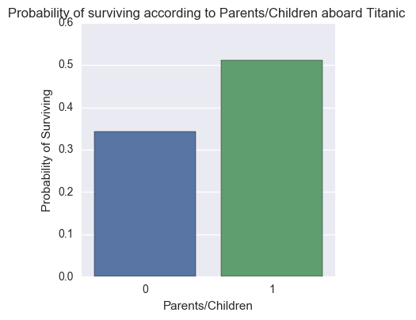


## Analysis by Gender


```python
# Creating 4 datasets -  male survivors, male non survivors / female survivors, female non survivors .

survived_male = titanic_survived[(titanic_survived['Sex'] == 'male')]

survived_female = titanic_survived[(titanic_survived['Sex'] == 'female')]

nsurvived_male = titanic_nsurvived[(titanic_nsurvived['Sex'] == 'male')]

nsurvived_female = titanic_nsurvived[(titanic_nsurvived['Sex'] == 'female')]
```


```python
# Male survivors and nonsurvivors by class
print(survived_male['Pclass'].value_counts())
print(' ')
print(nsurvived_male['Pclass'].value_counts())
```

    3    47
    1    45
    2    17
    Name: Pclass, dtype: int64
     
    3    300
    2     91
    1     77
    Name: Pclass, dtype: int64
    


```python
# Female survivors and nonsurvivors by class
print(survived_female['Pclass'].value_counts())
print(' ')
print(nsurvived_female['Pclass'].value_counts())
```

    1    91
    3    72
    2    70
    Name: Pclass, dtype: int64
     
    3    72
    2     6
    1     3
    Name: Pclass, dtype: int64
    


```python
# Number of female/male survivors in each class (1, 2 and 3)/ Total number of female/male passengers in that class (survivors and nonsurvivors)
titanic_1.groupby(['Sex', 'Pclass'])['Survived'].mean()
```


    Sex     Pclass
    female  1         0.968085
            2         0.921053
            3         0.500000
    male    1         0.368852
            2         0.157407
            3         0.135447
    Name: Survived, dtype: float64


###### Probability of surviving according to gender and class

P(Survive|1 and male) = 0.3689     
P(Survive|2 and male) = 0.1574     
P(Survive|3 and male) = 0.1354

P(Survive|1 and female) = 0.9681     
P(Survive|2 and female) = 0.9211    
P(Survive|3 and female) = 0.5000

The conditional probability values above show that the probability of surviving is greater for women than for men, regardless the class. Note that for women in the first and second class, the probability of surviving is very high.


```python
# Creating a Series which contain the age of male survivors and dropping missing values
survived_male_age = survived_male['Age'].dropna()

plt.hist(survived_male_age, bins=10)
plt.xlabel('Passenger Age')
plt.ylabel('Frequency')
plt.title('Distribution of age for male survivors')
```


    <matplotlib.text.Text at 0x148b7cf8>


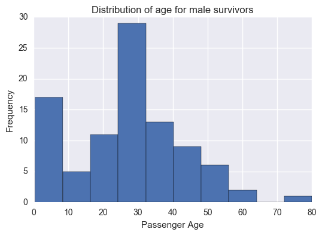


```python
# Creating a Series which contain the age of male nonsurvivors and dropping missing values
nsurvived_male_age = nsurvived_male['Age'].dropna()

plt.hist(nsurvived_male_age, bins=10)
plt.xlabel('Passenger Age')
plt.ylabel('Frequency')
plt.title('Distribution of age for male nonsurvivors')
```


    <matplotlib.text.Text at 0x14bf7a20>


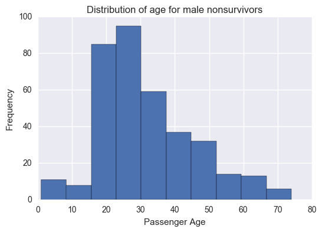


```python
# Creating a DataFrame in order to make a boxplot
titanic_male = titanic_1[(titanic_1['Sex'] == 'male')]
male_age_df = titanic_male[['Age', 'Survived']].dropna()
male_age_df.head()
```


<div>
<table border="1" class="dataframe">
  <thead>
    <tr style="text-align: right;">
      <th></th>
      <th>Age</th>
      <th>Survived</th>
    </tr>
  </thead>
  <tbody>
    <tr>
      <th>0</th>
      <td>22.0</td>
      <td>0</td>
    </tr>
    <tr>
      <th>4</th>
      <td>35.0</td>
      <td>0</td>
    </tr>
    <tr>
      <th>6</th>
      <td>54.0</td>
      <td>0</td>
    </tr>
    <tr>
      <th>7</th>
      <td>2.0</td>
      <td>0</td>
    </tr>
    <tr>
      <th>12</th>
      <td>20.0</td>
      <td>0</td>
    </tr>
  </tbody>
</table>
</div>


```python
# Descriptive Statistics of Age for male passengers
male_age_df['Age'].describe()


```


    count    453.000000
    mean      30.726645
    std       14.678201
    min        0.420000
    25%       21.000000
    50%       29.000000
    75%       39.000000
    max       80.000000
    Name: Age, dtype: float64


```python
# Boxplot of the variable Age (in years) for male survivors (1) and nonsurvivors (0)
male_age_df.boxplot(by = 'Survived')
```


    <matplotlib.axes._subplots.AxesSubplot at 0x14e186d8>


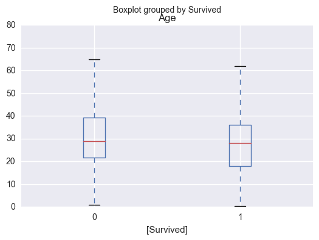


```python
# Creating a Series which contain the age of female survivors and dropping missing values
survived_female_age = survived_female['Age'].dropna()

plt.hist(survived_female_age, bins=10)
plt.xlabel('Passenger Age')
plt.ylabel('Frequency')
plt.title('Distribution of age for female survivors')

```


    <matplotlib.text.Text at 0x15146be0>


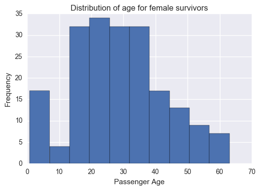


```python
# Creating a Series which contain the age of female nonsurvivors and dropping missing values
nsurvived_female_age = nsurvived_female['Age'].dropna()

plt.hist(nsurvived_female_age, bins=10)
plt.xlabel('Passenger Age')
plt.ylabel('Frequency')
plt.title('Distribution of age for female nonsurvivors')
```


    <matplotlib.text.Text at 0x15135b70>


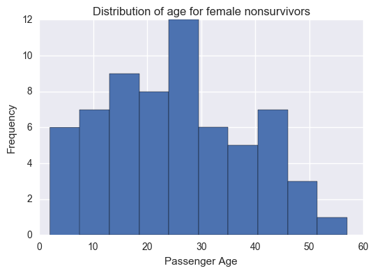


```python
# Creating a DataFrame in order to make a boxplot
titanic_female = titanic_1[(titanic_1['Sex'] == 'female')]
female_age_df = titanic_female[['Age', 'Survived']].dropna()
female_age_df.head()
```


<div>
<table border="1" class="dataframe">
  <thead>
    <tr style="text-align: right;">
      <th></th>
      <th>Age</th>
      <th>Survived</th>
    </tr>
  </thead>
  <tbody>
    <tr>
      <th>1</th>
      <td>38.0</td>
      <td>1</td>
    </tr>
    <tr>
      <th>2</th>
      <td>26.0</td>
      <td>1</td>
    </tr>
    <tr>
      <th>3</th>
      <td>35.0</td>
      <td>1</td>
    </tr>
    <tr>
      <th>8</th>
      <td>27.0</td>
      <td>1</td>
    </tr>
    <tr>
      <th>9</th>
      <td>14.0</td>
      <td>1</td>
    </tr>
  </tbody>
</table>
</div>


```python
# Descriptive Statistics of Age for female passengers

female_age_df['Age'].describe()

```


    count    261.000000
    mean      27.915709
    std       14.110146
    min        0.750000
    25%       18.000000
    50%       27.000000
    75%       37.000000
    max       63.000000
    Name: Age, dtype: float64


```python
# Boxplot of the variable Age (in years) for female survivors (1) and nonsurvivors (0)

female_age_df.boxplot(by = 'Survived')
```


    <matplotlib.axes._subplots.AxesSubplot at 0x15593f60>


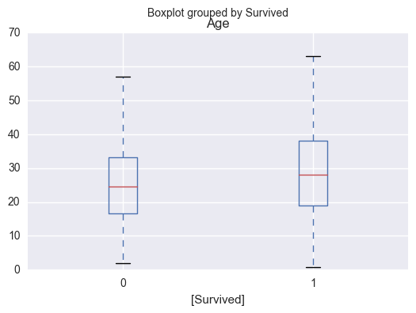


###### Distribution of Age by gender

It seems that for children and teenagers, the shape of the distribution for survivors is similar for male and female passengers. However, for adult women and men, the shape of the distribution is different, there are more adult women who survived than adult men who survived.

For nonsurvivors, there is a great number of men between 20 and 40 years old, but the descriptive statistics and the boxplot showed that 50% of male passengers are older than 21 and younger than 39 years. This way, it seems plausible that a great part of nonsurvivors is between 20 and 40 years old.

## Correlation Analysis

The correlation coefficient between age and the variable survived is -0.077. This correlation is near zero, so, there is almost no correlation between these two variables.


```python
# testing the correlation between Age and the variable survived

surv_age_df = titanic_dataset[['Survived', 'Age']].dropna()

surv_age_cor = surv_age_df['Survived']

age_surv_cor = surv_age_df['Age']

Corr_surv_age = np.corrcoef(surv_age_cor,age_surv_cor)

print(Corr_surv_age)
```

    [[ 1.         -0.07722109]
     [-0.07722109  1.        ]]
    

## Regression Analysis


```python
# Creating a DataFrame for Regression

titanic_regression = titanic_dataset[['PassengerId', 'Survived', 'Pclass', 'Sex', 'Age', 'SibSp', 'Parch']]

```


```python

"""
Recoding dummy variables for regression:
Sex: 0 if the passenger is male, 1 if the passenger is female
SibSp: 0 if the passenger had not siblings or spouse aboard Titanic, 1 if the passenger had at least one sibling or spouse aboard Titanic. 
Parch: 0 if the passenger had not parents or children aboard Titanic, 1 if the passenger had at least one parent or child aboard Titanic. 
"""

recode = {'male': 0, 'female': 1}

recode1 = {0: 0, 1: 1, 2: 1, 3: 1, 4: 1, 5: 1, 8: 1}

recode2 = {0: 0, 1: 1, 2: 1, 3: 1, 4: 1, 5: 1, 6: 1}


titanic_regression['Sex'] = titanic_regression['Sex'].map(recode)

titanic_regression['SibSp'] = titanic_regression['SibSp'].map(recode1)

titanic_regression['Parch'] = titanic_regression['Parch'].map(recode2)

```

    C:\Users\Patricia\Anaconda2\tentativa3\lib\site-packages\ipykernel\__main__.py:16: SettingWithCopyWarning: 
    A value is trying to be set on a copy of a slice from a DataFrame.
    Try using .loc[row_indexer,col_indexer] = value instead
    
    See the caveats in the documentation: http://pandas.pydata.org/pandas-docs/stable/indexing.html#indexing-view-versus-copy
    C:\Users\Patricia\Anaconda2\tentativa3\lib\site-packages\ipykernel\__main__.py:18: SettingWithCopyWarning: 
    A value is trying to be set on a copy of a slice from a DataFrame.
    Try using .loc[row_indexer,col_indexer] = value instead
    
    See the caveats in the documentation: http://pandas.pydata.org/pandas-docs/stable/indexing.html#indexing-view-versus-copy
    C:\Users\Patricia\Anaconda2\tentativa3\lib\site-packages\ipykernel\__main__.py:20: SettingWithCopyWarning: 
    A value is trying to be set on a copy of a slice from a DataFrame.
    Try using .loc[row_indexer,col_indexer] = value instead
    
    See the caveats in the documentation: http://pandas.pydata.org/pandas-docs/stable/indexing.html#indexing-view-versus-copy
    


```python
titanic_regression.head()
```


<div>
<table border="1" class="dataframe">
  <thead>
    <tr style="text-align: right;">
      <th></th>
      <th>PassengerId</th>
      <th>Survived</th>
      <th>Pclass</th>
      <th>Sex</th>
      <th>Age</th>
      <th>SibSp</th>
      <th>Parch</th>
    </tr>
  </thead>
  <tbody>
    <tr>
      <th>0</th>
      <td>1</td>
      <td>0</td>
      <td>3</td>
      <td>0</td>
      <td>22.0</td>
      <td>1</td>
      <td>0</td>
    </tr>
    <tr>
      <th>1</th>
      <td>2</td>
      <td>1</td>
      <td>1</td>
      <td>1</td>
      <td>38.0</td>
      <td>1</td>
      <td>0</td>
    </tr>
    <tr>
      <th>2</th>
      <td>3</td>
      <td>1</td>
      <td>3</td>
      <td>1</td>
      <td>26.0</td>
      <td>0</td>
      <td>0</td>
    </tr>
    <tr>
      <th>3</th>
      <td>4</td>
      <td>1</td>
      <td>1</td>
      <td>1</td>
      <td>35.0</td>
      <td>1</td>
      <td>0</td>
    </tr>
    <tr>
      <th>4</th>
      <td>5</td>
      <td>0</td>
      <td>3</td>
      <td>0</td>
      <td>35.0</td>
      <td>0</td>
      <td>0</td>
    </tr>
  </tbody>
</table>
</div>


```python
# Values of the variable SibSp
titanic_regression['SibSp'].value_counts()
```


    0    608
    1    283
    Name: SibSp, dtype: int64


```python
# Values of the variable Parch
titanic_regression['Parch'].value_counts()
```


    0    678
    1    213
    Name: Parch, dtype: int64


```python
# Values of the variable Sex
titanic_regression['Sex'].value_counts()
```


    0    577
    1    314
    Name: Sex, dtype: int64


###### Logistic Regression Model

Response Variable: Survived: 1 - Survived; 0 - Did not survive

Explanatory Variables: Pclass: 1, 2, 3

                   Sex: 1 - female; 0 - male
                       
                   Age: quantitative variable 
                       
                   SibSp: 1 - at least one sibling or spouse aboard Titanic; 0 - no sibling or spouse aboard Titanic 
                       
                   Parch: 1 - at least one parent or child aboard Titanic; 0 - no parent or child aboard Titanic


```python
import statsmodels.api
import statsmodels.formula.api as smf

reg1 = smf.logit(formula = 'Survived ~ C(Pclass, Treatment(reference=1)) + Sex + Age + SibSp + Parch', data = titanic_regression).fit()
print (reg1.summary())
```

    Optimization terminated successfully.
             Current function value: 0.452071
             Iterations 6
                               Logit Regression Results                           
    ==============================================================================
    Dep. Variable:               Survived   No. Observations:                  714
    Model:                          Logit   Df Residuals:                      707
    Method:                           MLE   Df Model:                            6
    Date:                Mon, 07 Nov 2016   Pseudo R-squ.:                  0.3307
    Time:                        03:24:34   Log-Likelihood:                -322.78
    converged:                       True   LL-Null:                       -482.26
                                            LLR p-value:                 7.059e-66
    ==========================================================================================================
                                                 coef    std err          z      P>|z|      [95.0% Conf. Int.]
    ----------------------------------------------------------------------------------------------------------
    Intercept                                  1.3966      0.397      3.519      0.000         0.619     2.174
    C(Pclass, Treatment(reference=1))[T.2]    -1.3349      0.280     -4.760      0.000        -1.885    -0.785
    C(Pclass, Treatment(reference=1))[T.3]    -2.6237      0.285     -9.192      0.000        -3.183    -2.064
    Sex                                        2.5566      0.214     11.944      0.000         2.137     2.976
    Age                                       -0.0384      0.008     -4.775      0.000        -0.054    -0.023
    SibSp                                     -0.2881      0.223     -1.293      0.196        -0.725     0.149
    Parch                                      0.0591      0.243      0.243      0.808        -0.417     0.535
    ==========================================================================================================
    


```python
# odds ratio with 95% confidence intervals
params = reg1.params
conf = reg1.conf_int()
conf['OR'] = params
conf.columns = ['Lower CI', 'Upper CI', 'OR']
print (np.exp(conf))
```

                                            Lower CI   Upper CI         OR
    Intercept                               1.856650   8.797213   4.041454
    C(Pclass, Treatment(reference=1))[T.2]  0.151894   0.455995   0.263178
    C(Pclass, Treatment(reference=1))[T.3]  0.041454   0.126910   0.072532
    Sex                                     8.474412  19.611231  12.891612
    Age                                     0.947300   0.977625   0.962343
    SibSp                                   0.484415   1.160158   0.749665
    Parch                                   0.659290   1.706934   1.060832
    

###### Regression 1 Results

The regression 1 results show that the variable Pclass is significant (p-value = 0.001) and the odd ratio is smaller than 1, meaning that if a passenger traveled in second or third class, he is less likely of surviving than a passenger who traveled in first class, the reference group. The variable Sex is also significant (p-value = 0.001) and the odd ratio is 12.89, meaning that a female passenger (1) is 12.89 times more likely of surviving than a male passenger. The variable Age is significant (p-value = 0.001) and the odd ratio is 0.96. An odd ratio near 1 means that there is an equal probability of surviving for young and old passengers. The variables SibSp and Parch were no significant to explain the probability of surviving. 

Regression 2

In regression 2, the variables which were no significant in the first model were excluded. Besides, the variable Age which has practically no effect on the probability of surviving was excluded. There was also a change in the reference group of the variable class, now the reference group is third class.


```python
reg2 = smf.logit(formula = 'Survived ~ C(Pclass, Treatment(reference=3)) + Sex ', data = titanic_regression).fit()
print (reg2.summary())

# odds ratio with 95% confidence intervals
params = reg2.params
conf_2 = reg2.conf_int()
conf_2['OR'] = params
conf_2.columns = ['Lower CI', 'Upper CI', 'OR']
print (np.exp(conf_2))
```

    Optimization terminated successfully.
             Current function value: 0.464023
             Iterations 6
                               Logit Regression Results                           
    ==============================================================================
    Dep. Variable:               Survived   No. Observations:                  891
    Model:                          Logit   Df Residuals:                      887
    Method:                           MLE   Df Model:                            3
    Date:                Mon, 07 Nov 2016   Pseudo R-squ.:                  0.3032
    Time:                        03:24:41   Log-Likelihood:                -413.44
    converged:                       True   LL-Null:                       -593.33
                                            LLR p-value:                 1.145e-77
    ==========================================================================================================
                                                 coef    std err          z      P>|z|      [95.0% Conf. Int.]
    ----------------------------------------------------------------------------------------------------------
    Intercept                                 -2.2502      0.159    -14.163      0.000        -2.562    -1.939
    C(Pclass, Treatment(reference=3))[T.1]     1.9055      0.214      8.898      0.000         1.486     2.325
    C(Pclass, Treatment(reference=3))[T.2]     1.0675      0.220      4.842      0.000         0.635     1.500
    Sex                                        2.6419      0.184     14.350      0.000         2.281     3.003
    ==========================================================================================================
                                            Lower CI   Upper CI         OR
    Intercept                               0.077177   0.143871   0.105373
    C(Pclass, Treatment(reference=3))[T.1]  4.418373  10.228917   6.722735
    C(Pclass, Treatment(reference=3))[T.2]  1.887830   4.480154   2.908225
    Sex                                     9.786868  20.140028  14.039509
    

###### Regression 2 Results

The main factors which are correlated to the probability of surviving are the passenger gender and the passenger class. The results suggest that a passenger who traveled in first class is 6.7 times more likely of surviving than a passenger who traveled in third class. A passenger who traveled in second class is 2.9 times more likely of surviving than a passenger who traveled in third class. Finally, a female passenger is 14 times more likely of surviving than a male passenger.

## Conclusions


1. There are 342 passengers who survived and 549 passengers who did not survive;
2. The group who survived is composed of 233 females and 109 males;
3. The age distribution is similar for the groups of survivors and nonsurvivors. For the group of survivors, the mean is 28.34, the median is 28 and the standard deviation is 14.95. For the group of nonsurvivors, the mean is 30.63, the median is 28 and the standard deviation is 14.17.
4. From 342 passengers who survived, 136 (40%) traveled in the first class, 87 (25%) passengers traveled in the second class, and 119 (35%) traveled in the third class.
5. The analysis of group revealed that the female passengers are more likely of surviving, as well as, the passengers who traveled in the first class. When considering the female passengers in the first and second class, the probability of surviving is higher than 0.90, and even for female passengers in the third class, the probability of surviving is 0.5. However, for male passengers, the probability of surviving, even in the first class, is smaller than 0.4. The age does not seem correlated to the probability of surviving. The conditional probability values indicate that the passengers who had siblings/spouse or parents/children aboard Titanic are more likely of surviving. However, in the regression analysis, these variables are not significant to explain the probability of surviving.
6. Finally, the regression model denote that the factors that matter in the probability of surviving are the passenger gender and class. The results show that female passengers are 14 times more likely of surviving than male passengers, and passengers in the first class are 6.7 times more likely of surviving than passengers in the third class.


Possible limitations of the analysis:

As the data analyzed is a sample, there is a risk that this sample is not representative of the population (all passengers of the Titanic).
The variable Age did not show different patterns for survivors and nonsurvivors. However, there are missing values in this variable which could change the pattern of the data. 
There could be some important information about the passengers which is not in the dataset.

###### Resources

Notes from the Intro to Data Analysis course

Notes from the Regression Modelling in Practice course (by Coursera) 


```python

```
